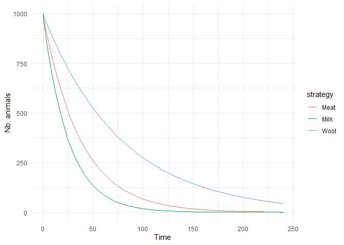

<!-- README.md is generated from README.Rmd. Please edit that file -->
<!-- badges: start -->
<!-- badges: end -->

# HerdDynamics

The goal of HerdDynamics is to provide a set of scripts to simulate the
growth of livestock herds under various management strategies.

## Installation

You can install the development version of HerdDynamics from
[GitHub](https://github.com/) with:

``` r
# install.packages("devtools")
devtools::install_github("penguinnick/HerdDynamics")
```

## Introduction - Livestock Population Dynamics and Stochastic Dynamic Programming

This document outlines the procedures for simulating goat and sheep herd
dynamics and using the resulting models in a stochastic dynamic program
that will identify the optimal culling strategy and herd reproduction
parameters. The code here supports Chapter 2 of Nick Triozzi’s PhD
Dissertation.

This is a basic example which shows you how to project herd growth under
a single offtake strategy:

    #> ── Attaching core tidyverse packages ──────────────────────── tidyverse 2.0.0 ──
    #> ✔ dplyr     1.1.4     ✔ readr     2.1.5
    #> ✔ forcats   1.0.0     ✔ stringr   1.5.1
    #> ✔ ggplot2   3.5.2     ✔ tibble    3.2.1
    #> ✔ lubridate 1.9.4     ✔ tidyr     1.3.1
    #> ✔ purrr     1.0.4     
    #> ── Conflicts ────────────────────────────────────────── tidyverse_conflicts() ──
    #> ✖ dplyr::filter() masks stats::filter()
    #> ✖ dplyr::lag()    masks stats::lag()
    #> ℹ Use the conflicted package (<http://conflicted.r-lib.org/>) to force all conflicts to become errors

## Age Classes

The first step is to build a table containing information about the age
groups used in the projections. In this program age classes for males
and females may be specified separately. However, culling profiles
constructed from archaeological remains cannot distinguish male from
female mandibles. Therefore, offtake rates modeled here will be applied
to the entire herd while intrinsic mortality rates will be defined
separately for males and females.

``` r

# The age classes are defined based on Payne's (1973) age classes for sheep and goats.
HerdDynamics::Payne_ages
#>   ageClasses  ages lclass
#> 1   A (0-2m)  0.17      2
#> 2   B (2-6m)  0.50      4
#> 3  C (6-12m)  1.00      6
#> 4   D (1-2y)  2.00     12
#> 5   E (2-3y)  3.00     12
#> 6   F (3-4y)  4.00     12
#> 7   G (4-6y)  6.00     24
#> 8   H (6-8y)  8.00     24
#> 9    I (>8y) 10.00    Inf

#-- create the tcla table, containing age classes for each sex, and the starting and ending ages for each class in months
tcla <- build_tcla( female.ages = Payne_ages$lclass/12, 
                    male.ages = Payne_ages$lclass/12, 
                    nbphase = 12 #The parameter nbphase is set to 12 which converts ages to months.
                    ) 
tcla
#>    sex class lclass cellmin cellmax
#> 1    F     0      2       0       0
#> 2    F     1      2       1       2
#> 3    F     2      4       3       6
#> 4    F     3      6       7      12
#> 5    F     4     12      13      24
#> 6    F     5     12      25      36
#> 7    F     6     12      37      48
#> 8    F     7     24      49      72
#> 9    F     8     24      73      96
#> 10   F     9    Inf      97     Inf
#> 11   M     0      2       0       0
#> 12   M     1      2       1       2
#> 13   M     2      4       3       6
#> 14   M     3      6       7      12
#> 15   M     4     12      13      24
#> 16   M     5     12      25      36
#> 17   M     6     12      37      48
#> 18   M     7     24      49      72
#> 19   M     8     24      73      96
#> 20   M     9    Inf      97     Inf
```

# Offtake

A set of offtake rates are included in the package as `offtake_models`.
This list contains survivorship rates for standardized age classes
following Marom and Bar-Oz (2009). These offtake rates usually describe
culling strategies for a whole herd, regardless of sex. Here we use them
to model the offtake rates of females. For now, we will focus only on
Payne’s (1973) meat, milk, and wool strategies.

``` r

#-- subset offtake models list for Milk, Meat, and Wool
offtake.models = HerdDynamics::offtake_models[c("Milk", "Meat", "Wool")]

#-- convert survivorship to mortality
offtake.models <- lapply(offtake.models, function(x) { 1 - (x / 100) })

#-- plot offtake models
plot_offtake(offtake.models, title = "Culling Strategies for Sheep and Goats")
```


## Herd Population Growth Parameters - Intrinsic Mortality

The probability that an animal will survive from one timestep to the
next is affected by the competing risks of being slaughtered (i.e.,
offtake) and intrinsic mortality. We set intrinsic mortality for males
and females separately.

``` r
#-- goat intrinsic mortality rates
doe.mortality =  c( 0.179, 0.453, 0.18, 0.18, 0.18, 0.18,  0.18,  0.18, 0.18)
buck.mortality = c(0.179,  0.453, 0.15, 0.15, 0.05, 0.05,  0.05,  1.00, 1.00)
```

## Fertility and Mortality Parameters

Several parameters are important regarding the reproductive biology of
goats and sheep. *part.age* specifies the age of first parturition.
*parturition* specifies the number of parturitions per female per year.
*prolificacy* specifies the prolificacy rate, defined as the number of
live offspring per parturition per year. Age-specific rates are
available.

``` r
#-- goat reproduction and mortality parameters
goat.parms = list(
  ages= c( Payne_ages$ages),
  parturition = 1.2,
  part.age = 2,  # age of first parturition
  prolificacy = c( 0, 0, 0, 0.82, 1.10, 1.41, 1.45, 1.03, 1.03), # number of livebirths expected per animal per parturition per year by age class
  f.mortality = doe.mortality,
  m.mortality = buck.mortality
  # f.offtake = doe.mortality/2
)

#-- example of how to set the parameters for a single offtake strategy
build_param(tcla = tcla, 
            parms = goat.parms, 
            Inf.Mortality = "auto", # setting this variable to "auto" will use the offtake model to calculate infant mortality rates based on the mean and standard deviation of mortality rates for animals under 1 year of age.
            prolificacyRate = "auto", # setting this variable to "auto" will calculate age-specific prolificacy rates based on the mean and standard deviation of prolificacy rates provided in the goat.parms list.
            offtake = offtake.models$Milk, 
            nbphase = 12 )
#> $param
#>    sex class lclass cellmin cellmax       nupar          ff          fm
#> 1    F     0      1       0       0 0.000000000 0.000000000 0.000000000
#> 2    F     1      2       1       2 0.000000000 0.000000000 0.000000000
#> 3    F     2      4       3       6 0.000000000 0.000000000 0.000000000
#> 4    F     3      6       7      12 0.008074147 0.002182051 0.002182051
#> 5    F     4     12      13      24 0.096647218 0.027344586 0.027344586
#> 6    F     5     12      25      36 0.096379122 0.055806501 0.055806501
#> 7    F     6     12      37      48 0.096186277 0.065547319 0.065547319
#> 8    F     7     24      49      72 0.096002221 0.065470295 0.065470295
#> 9    F     8     24      73      96 0.095995832 0.060495733 0.060495733
#> 10   F     9    Inf      97     Inf 0.095696559 0.052585120 0.052585120
#> 11   M     0      1       0       0 0.000000000 0.000000000 0.000000000
#> 12   M     1      2       1       2 0.000000000 0.000000000 0.000000000
#> 13   M     2      4       3       6 0.000000000 0.000000000 0.000000000
#> 14   M     3      6       7      12 0.000000000 0.000000000 0.000000000
#> 15   M     4     12      13      24 0.000000000 0.000000000 0.000000000
#> 16   M     5     12      25      36 0.000000000 0.000000000 0.000000000
#> 17   M     6     12      37      48 0.000000000 0.000000000 0.000000000
#> 18   M     7     24      49      72 0.000000000 0.000000000 0.000000000
#> 19   M     8     24      73      96 0.000000000 0.000000000 0.000000000
#> 20   M     9    Inf      97     Inf 0.000000000 0.000000000 0.000000000
#>           pdea       poff           g
#> 1  0.016838730 0.02165551 1.000000000
#> 2  0.032448802 0.04346968 0.480271501
#> 3  0.028453682 0.04679178 0.221472660
#> 4  0.012700417 0.04950442 0.141094370
#> 5  0.014491265 0.05256438 0.055287947
#> 6  0.014450064 0.05796750 0.053300717
#> 7  0.014420378 0.06185407 0.051896501
#> 8  0.014392005 0.06556358 0.013602017
#> 9  0.014391020 0.06569234 0.013573233
#> 10 0.014344802 0.07172401 0.000000000
#> 11 0.008136429 0.02175165 1.000000000
#> 12 0.015426863 0.04385468 0.484726909
#> 13 0.013444199 0.04715649 0.227067597
#> 14 0.012204484 0.04951704 0.141289778
#> 15 0.011757145 0.05263842 0.056288824
#> 16 0.004035454 0.05827867 0.057078858
#> 17 0.004027148 0.06218588 0.055603919
#> 18 0.005605579 0.06586137 0.015620369
#> 19 0.077316383 0.06352829 0.004404573
#> 20 0.077070941 0.06936385 0.000000000
#> 
#> $parms
#> $parms$ages
#> [1]  0.17  0.50  1.00  2.00  3.00  4.00  6.00  8.00 10.00
#> 
#> $parms$parturition
#> [1] 1.2
#> 
#> $parms$part.age
#> [1] 2
#> 
#> $parms$prolificacy
#> [1] 0.00 0.00 0.00 0.82 1.10 1.41 1.45 1.03 1.03
#> 
#> $parms$f.mortality
#> [1] 0.179 0.453 0.180 0.180 0.180 0.180 0.180 0.180 0.180
#> 
#> $parms$m.mortality
#> [1] 0.179 0.453 0.150 0.150 0.050 0.050 0.050 1.000 1.000
#> 
#> 
#> $NetProlificacy
#> [1] 1.130221
#> 
#> $Mortality
#> [1] 0.2693901
#> 
#> $offtake
#>  [1] 0.00 0.53 0.58 0.61 0.65 0.72 0.77 0.82 0.82 0.90
#> 
#> $female.offtake
#> NULL
#> 
#> $correctionfec
#> [1] TRUE
#> 
#> $phi
#> NULL

#-- create a list of parameters for each offtake strategy
param = lapply(offtake.models, function(o) { 
  build_param(tcla = tcla, 
              parms = goat.parms, 
              Inf.Mortality = "auto", 
              prolificacyRate = "auto", 
              nbphase = 12,
              offtake = o)
  })

#-- inspect Milk model transition matrix parameters
param$Milk$param
#>    sex class lclass cellmin cellmax       nupar          ff          fm
#> 1    F     0      1       0       0 0.000000000 0.000000000 0.000000000
#> 2    F     1      2       1       2 0.000000000 0.000000000 0.000000000
#> 3    F     2      4       3       6 0.000000000 0.000000000 0.000000000
#> 4    F     3      6       7      12 0.008035275 0.004077075 0.004077075
#> 5    F     4     12      13      24 0.096647218 0.049137732 0.049137732
#> 6    F     5     12      25      36 0.096379122 0.051557652 0.051557652
#> 7    F     6     12      37      48 0.096186277 0.058524804 0.058524804
#> 8    F     7     24      49      72 0.096002221 0.072404654 0.072404654
#> 9    F     8     24      73      96 0.095995832 0.053102785 0.053102785
#> 10   F     9    Inf      97     Inf 0.095696559 0.049472775 0.049472775
#> 11   M     0      1       0       0 0.000000000 0.000000000 0.000000000
#> 12   M     1      2       1       2 0.000000000 0.000000000 0.000000000
#> 13   M     2      4       3       6 0.000000000 0.000000000 0.000000000
#> 14   M     3      6       7      12 0.000000000 0.000000000 0.000000000
#> 15   M     4     12      13      24 0.000000000 0.000000000 0.000000000
#> 16   M     5     12      25      36 0.000000000 0.000000000 0.000000000
#> 17   M     6     12      37      48 0.000000000 0.000000000 0.000000000
#> 18   M     7     24      49      72 0.000000000 0.000000000 0.000000000
#> 19   M     8     24      73      96 0.000000000 0.000000000 0.000000000
#> 20   M     9    Inf      97     Inf 0.000000000 0.000000000 0.000000000
#>           pdea       poff           g
#> 1  0.026453103 0.02154897 1.000000000
#> 2  0.044690688 0.04319138 0.477019705
#> 3  0.023511157 0.04691209 0.223316845
#> 4  0.022273576 0.04926041 0.137334829
#> 5  0.014491265 0.05256438 0.055287947
#> 6  0.014450064 0.05796750 0.053300717
#> 7  0.014420378 0.06185407 0.051896501
#> 8  0.014392005 0.06556358 0.013602017
#> 9  0.014391020 0.06569234 0.013573233
#> 10 0.014344802 0.07172401 0.000000000
#> 11 0.014229042 0.02168437 1.000000000
#> 12 0.027444193 0.04358311 0.481589345
#> 13 0.023970298 0.04690092 0.223145600
#> 14 0.010272452 0.04956618 0.142051626
#> 15 0.011757145 0.05263842 0.056288824
#> 16 0.004035454 0.05827867 0.057078858
#> 17 0.004027148 0.06218588 0.055603919
#> 18 0.005605579 0.06586137 0.015620369
#> 19 0.077316383 0.06352829 0.004404573
#> 20 0.077070941 0.06936385 0.000000000
```

## Reproductive Values

After setting these variables we create a parameter data frame that will
be used to compute lambda, reproductive values, and project herd growth.
The function *get_lambda* will calculate the reproductive values for
each age class and the overall lambda value (growth rate) for the herd.

``` r
#-- get reproductive parameters using the get_lambda function with an initial herd size of 1000 animals
milk.lambda = get_lambda(param$Milk$param, tcla = tcla, p0=1000)

#-- herd growth rate
milk.lambda$lambda
#> [1] 0.961

#-- sex proportion of herd
milk.lambda$sex.proportion
#> # A tibble: 2 × 2
#>   sex   p.sex
#>   <chr> <dbl>
#> 1 F     0.449
#> 2 M     0.551

#-- initial age structure of herd
milk.lambda$initial.herd %>% 
  mutate(ages = rep(Payne_ages$ageClasses, 2)) %>%
  ggplot(aes(x = ages, y = xini, group = sex)) +
  geom_col(aes(fill = sex)) + 
  coord_flip() +
  theme_minimal()
```


``` r

#-- get reproductive values for all offtake strategies
repro = lapply(param, function(p){ get_lambda(p$param, tcla, p0=1000) }) 
```

## Demographic Projection

Now we run the projection. We start with an initial herd size of 200
animals. First we define *nbcycle* as number of cycles to project
through (i.e., years). We keep the previously defined value *nbphase*
(nbphase=12=12 months). *nbstep* is the product of these values and will
calculate the change in herd demography from one phase to the next
(i.e., from 1 month to the next).

lapply is used to run the function *project_herd* and stores the
projection *results* as a list.

``` r
#-- put all parameters into a list
all.param = param_list(param, repro)
str(all.param$Milk, 2)
#> List of 5
#>  $ param         :List of 8
#>   ..$ param         :'data.frame':   20 obs. of  11 variables:
#>   ..$ parms         :List of 6
#>   ..$ NetProlificacy: num 1.16
#>   ..$ Mortality     : num 0.3
#>   ..$ offtake       : num [1:10] 0 0.53 0.58 0.61 0.65 0.72 0.77 0.82 0.82 0.9
#>   ..$ female.offtake: NULL
#>   ..$ correctionfec : logi TRUE
#>   ..$ phi           : NULL
#>  $ lambda        : num 0.961
#>  $ sex.proportion: tibble [2 × 2] (S3: tbl_df/tbl/data.frame)
#>  $ initial.herd  :'data.frame':  18 obs. of  7 variables:
#>   ..$ sex    : chr [1:18] "F" "F" "F" "F" ...
#>   ..$ class  : int [1:18] 1 2 3 4 5 6 7 8 9 1 ...
#>   ..$ lclass : num [1:18] 2 4 6 12 12 ...
#>   ..$ cellmin: num [1:18] 1 3 7 13 25 37 49 73 97 1 ...
#>   ..$ cellmax: num [1:18] 2 6 12 24 36 ...
#>   ..$ xini   : num [1:18] 31.3 57 74 118.8 74.1 ...
#>   ..$ rep.val: num [1:18] 1.59 1.77 2.03 2.5 2.41 ...
#>  $ p0            : num 1000

#-- set the number of cycles and phases
nbcycle = 20 # 20 years
nbphase = 12 # in monthly timesteps

#-- project herd growth
results = lapply(all.param, function(a){ project_herd(a, 20, 12)})
```



# References

<div id="refs" class="references csl-bib-body hanging-indent"
entry-spacing="0">

<div id="ref-Marom2009" class="csl-entry">

Marom, Nimrod, and Guy Bar-Oz. 2009. “<span class="nocase">Culling
profiles: the indeterminacy of archaeozoological data to survivorship
curve modelling of sheep and goat herd maintenance strategies</span>.”
*Journal of Archaeological Science* 36 (5): 1184–87.
<https://doi.org/10.1016/j.jas.2009.01.007>.

</div>

<div id="ref-Payne1973" class="csl-entry">

Payne, Sebastian. 1973. “<span class="nocase">Kill-off Patterns in Sheep
and Goats: The Mandibles from Aşvan Kale</span>.” *Anatolian Studies* 23
(September): 281–303. <https://doi.org/10.2307/3642547>.

</div>

</div>
