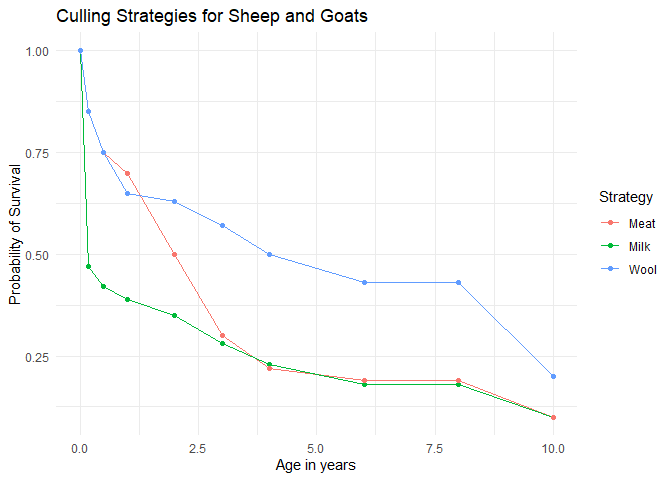
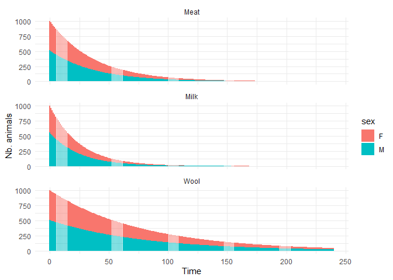

<!-- README.md is generated from README.Rmd. Please edit that file -->
<!-- badges: start -->
<!-- badges: end -->

# HerdDynamics

The goal of HerdDynamics is to provide a set of scripts to simulate the
growth of livestock herds under various management strategies.

## Installation

You can install the development version of HerdDynamics from
[GitHub](https://github.com/) with:

``` r
# install.packages("devtools")
devtools::install_github("penguinnick/HerdDynamics")
```

## Introduction - Livestock Population Dynamics and Stochastic Dynamic Programming

This document outlines the procedures for simulating goat and sheep herd
dynamics and using the resulting models in a stochastic dynamic program
that will identify the optimal culling strategy and herd reproduction
parameters. The code here supports Chapter 2 of Nick Triozzi’s PhD
Dissertation.

This is a basic example which shows you how to project herd growth under
a single offtake strategy:

``` r
library(HerdDynamics)
```

## Age Classes

The first step is to establish age classes for the simulation. In this
program age classes for males and females may be specified separately.
However, culling profiles constructed from archaeological remains cannot
distinguish male from female mandibles. Therefore, offtake rates modeled
here will be applied to the entire herd while separate intrinsic
mortality rates will be defined separately for males and females.

``` r
#-- Age classes specifying the length of each age class, in years.
ages = c(0.17, 0.5, 1, 2, 3, 4, 5, 6, 7, 8)
lclass = c(0.17, 0.5, 1, 1, 1, 1, 1, 1, 1, 1)
tcla = build_tcla(female.ages = lclass, male.ages = lclass, nbphase = 12) #The parameter nbphase is set to 12 which converts ages to months.
head(tcla)
#>   sex class lclass cellmin cellmax
#> 1   F     0   2.04    0.00    0.00
#> 2   F     1   2.04    1.00    2.04
#> 3   F     2   6.00    3.04    8.04
#> 4   F     3  12.00    9.04   20.04
#> 5   F     4  12.00   21.04   32.04
#> 6   F     5  12.00   33.04   44.04
```

# Offtake

The offtake rates given here are generated from zooarchaeological
research which does not account for sex-based differences in culling
practices. These offtake rates usually describe culling strategies for a
whole herd, regardless of sex. Here we use them to model the offtake
rates of females.

``` r
#-- create a list of offtake strategies specifying probability of survival by age
offtake.models = list(
  Meat     = c( 100,   85,   75,   70,     50, 30, 22,   19,   19, 10),    # Payne 1973
  Milk     = c( 100,   47,   42,   39,     35, 28, 23,   18,   19, 10),    # Payne 1973
  Wool     = c( 100,   85,   75,   65,     63, 57, 50,   43,   43, 20))    # Payne 1973

#-- convert survivorship to mortality
offtake.models = lapply(offtake.models, function(x){1-(x/100)})

#-- plot offtake models
title = "Culling Strategies for Sheep and Goats"
plot_offtake(offtake.models, ages, title)
```



## Herd Population Growth Parameters - Intrinsic Mortality

The probability that an animal will survive from one timestep to the
next is affected by the competing risks of being slaughtered (i.e.,
offtake) and intrinsic mortality. We set intrinsic mortality for males
and females separately.

``` r
#-- goat intrinsic mortality rates
doe.mortality =  c( 0.179, 0.453, 0.18, 0.18, 0.18, 0.18, 0.18,  0.18,  0.18, 0.18)
buck.mortality = c(0.179,  0.453, 0.15, 0.15, 0.05, 0.05, 0.05,  0.05,  1.00, 1.00)
```

## Reproduction Parameters

Several parameters are important regarding the reproductive biology of
goats and sheep. *part.age* specifies the age of first parturition.
*parturition* specifies the number of parturitions per female per year.
*prolificacy* specifies the prolificacy rate, defined as the number of
live offspring per parturition per year. Age-specific rates are
available.

After setting these variables we create a parameter data frame that will
be used to compute lambda, reproductive values, and project herd growth

``` r
goat.parms = list(
  ages=ages,
  parturition = 1.2,
  part.age = 2,  # age of first parturition
  prolificacy = c( 0, 0, 0, 0.82, 1.10, 1.41, 1.45, 1.03, 1.03, 1.03),
  f.mortality = doe.mortality,
  m.mortality = buck.mortality,
  m.offtake = c(    0,   25,   25,     50, 75, 75,   75,   80, 90,  100)  / 100 # male offtake
)
build_param(tcla, parms = goat.parms, offtake = offtake.models$Meat, phase="year")
#> Loading required package: mmage
#>    sex class lclass cellmin cellmax      nupar         ff         fm       pdea
#> 1    F     0   1.00    0.00    0.00 0.00000000 0.00000000 0.00000000 0.08561173
#> 2    F     1   2.04    1.00    2.04 0.00000000 0.00000000 0.00000000 0.21439952
#> 3    F     2   6.00    3.04    8.04 0.00000000 0.00000000 0.00000000 0.32520896
#> 4    F     3  12.00    9.04   20.04 0.04122888 0.01690384 0.01690384 0.14615711
#> 5    F     4  12.00   21.04   32.04 0.96818897 0.40260525 0.40260525 0.14240950
#> 6    F     5  12.00   33.04   44.04 0.90144764 0.50161805 0.50161805 0.13011967
#> 7    F     6  12.00   45.04   56.04 0.84804156 0.59857600 0.59857600 0.11953305
#> 8    F     7  12.00   57.04   68.04 0.82944874 0.59409266 0.59409266 0.11564669
#> 9    F     8  12.00   69.04   80.04 0.82294601 0.42381720 0.42381720 0.11425878
#> 10   F     9  12.00   81.04   92.04 0.82211153 0.42338744 0.42338744 0.11407954
#> 11   F    10  12.00   93.04  104.04 0.79609443 0.40998863 0.40998863 0.12891671
#> 12   F    11   1.00  105.04  105.04 0.60000000 0.30900000 0.30900000 0.43233236
#> 13   M     0   1.00    0.00    0.00 0.00000000 0.00000000 0.00000000 0.08561173
#> 14   M     1   2.04    1.00    2.04 0.00000000 0.00000000 0.00000000 0.21439952
#> 15   M     2   6.00    3.04    8.04 0.00000000 0.00000000 0.00000000 0.32368433
#> 16   M     3  12.00    9.04   20.04 0.00000000 0.00000000 0.00000000 0.12350984
#> 17   M     4  12.00   21.04   32.04 0.00000000 0.00000000 0.00000000 0.11720925
#> 18   M     5  12.00   33.04   44.04 0.00000000 0.00000000 0.00000000 0.03831386
#> 19   M     6  12.00   45.04   56.04 0.00000000 0.00000000 0.00000000 0.03512425
#> 20   M     7  12.00   57.04   68.04 0.00000000 0.00000000 0.00000000 0.03395461
#> 21   M     8  12.00   69.04   80.04 0.00000000 0.00000000 0.00000000 0.05907878
#> 22   M     9  12.00   81.04   92.04 0.00000000 0.00000000 0.00000000 0.46145192
#> 23   M    10  12.00   93.04  104.04 0.00000000 0.00000000 0.00000000 0.44694265
#> 24   M    11   1.00  105.04  105.04 0.00000000 0.00000000 0.00000000 0.43233236
#>          poff            g
#> 1  0.00000000 1.000000e+00
#> 2  0.03202159 4.187097e-01
#> 3  0.11967790 2.415765e-02
#> 4  0.20468761 3.043605e-03
#> 5  0.24394221 1.800270e-03
#> 6  0.36746760 2.562410e-04
#> 7  0.46706434 3.535544e-05
#> 8  0.50193874 1.579720e-05
#> 9  0.51416453 1.171624e-05
#> 10 0.51573457 1.126766e-05
#> 11 0.54425925 3.059027e-06
#> 12 0.56766764 1.000000e+00
#> 13 0.00000000 1.000000e+00
#> 14 0.03202159 4.187097e-01
#> 15 0.11981302 2.439623e-02
#> 16 0.20756516 4.004774e-03
#> 17 0.24781385 2.480432e-03
#> 18 0.38952427 9.215575e-04
#> 19 0.49408113 1.332975e-04
#> 20 0.53054082 6.033933e-05
#> 21 0.53418212 2.990403e-05
#> 22 0.37550650 1.811282e-09
#> 23 0.40411064 6.812349e-10
#> 24 0.56766764 1.000000e+00
# build_param(tcla, parms = goat.parms, offtake = offtake.models$Meat, phase="month")
param = lapply(offtake.models, function(o){build_param(tcla = tcla, parms=goat.parms, male.offtake = TRUE, offtake = o, phase="month")})
repro = lapply(param, function(p){ get_lambda(p, tcla, p0=1000) }) 
```

## Demographic Projection

Now we run the projection. We start with an initial herd size of 200
animals. First we define *nbcycle* as number of cycles to project
through (i.e., years). We keep the previously defined value *nbphase*
(nbphase=12=12 months). *nbstep* is the product of these values and will
calculate the change in herd demography from one phase to the next
(i.e., from 1 month to the next).

lapply is used to run the function *projest_herd* and stores the
projection *results* as a list.

``` r
all.param = param_list(param, repro)
#-- put all parameters into a list
results = lapply(all.param, function(a){project_herd(a, 20, 12)})
# summarize results
tot.pop.res = lapply(results, function(r){pop_summary(r, interval = "month")})

res.to.df = function(tot.pop.res){
  df = do.call(rbind.data.frame, args=c(tot.pop.res, make.row.names=FALSE))
  strats = names(tot.pop.res)
  df$strategy = unlist(lapply(strats, FUN=rep, (nrow(df)/length(strats))))
  return(df)
}
z = res.to.df(tot.pop.res)
```



You’ll still need to render `README.Rmd` regularly, to keep `README.md`
up-to-date. `devtools::build_readme()` is handy for this. You could also
use GitHub Actions to re-render `README.Rmd` every time you push. An
example workflow can be found here:
<https://github.com/r-lib/actions/tree/v1/examples>.

You can also embed plots, for example:

In that case, don’t forget to commit and push the resulting figure
files, so they display on GitHub and CRAN.
